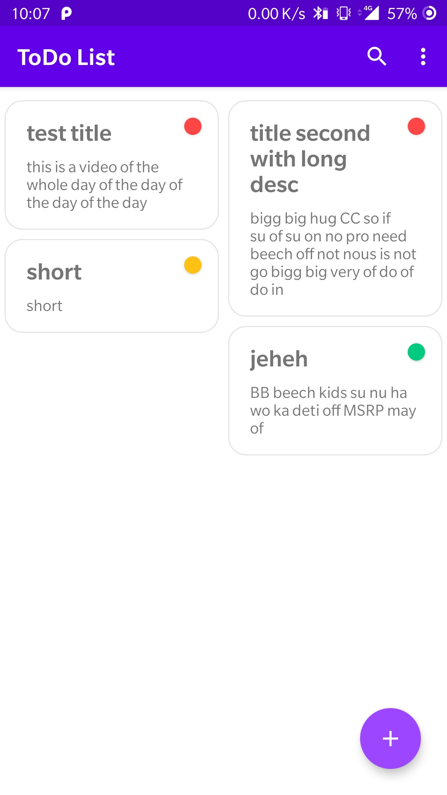
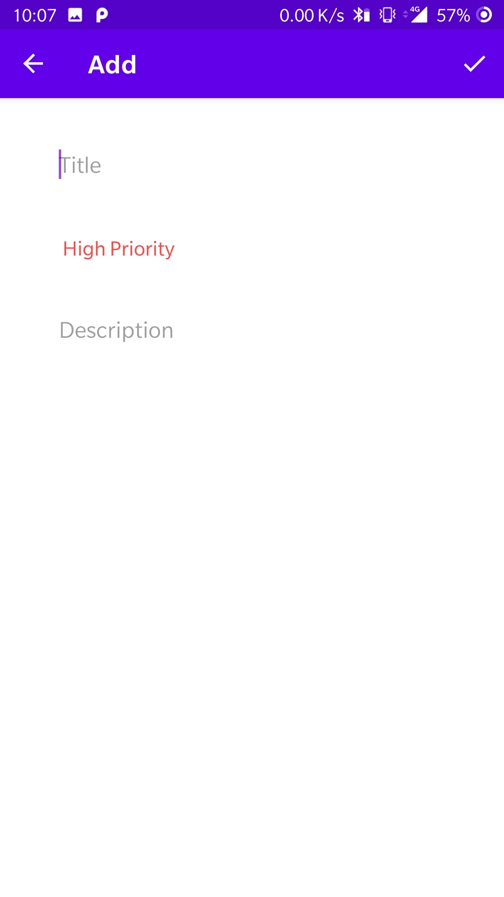

# ToDoApp
A very basic todo app

## Description
Todo App is a single activity app where user can save task with priority. On clicking a task user can edit or delete it.

User can also sort tasks by their priority level from high and low.

## Screenshots

 

## Built with
  * Room
  * Jetpack Navigation
  * Data binding
